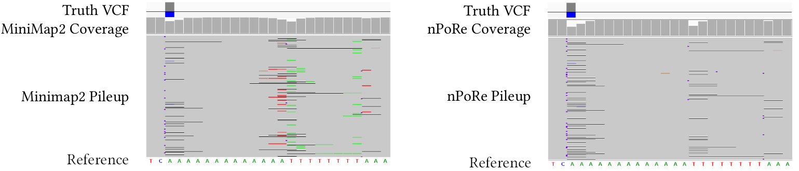

# nPoRe: n-Polymer Realigner for improved pileup variant calling

[](https://zenodo.org/badge/latestdoi/365294513)

## Introduction
`npore` is a read realigner which recalculates each read's fine-grained alignment in order to more accurately align ''n-polymers'' such as homopolymers (n=1) and tandem repeats (2 &leq; n &leq; 6). In other words, given an input BAM, it adjusts each read's CIGAR string to more accurately model the most likely sequencing errors and actual variants. Traditional affine gap penalties are context-agnostic, and do not model the higher likelihood of INDELs in low-complexity regions (particularly n-polymers), leading to poor or inconsistent alignments. We find that `npore` improves pileup concordance across reads and results in slightly better variant calling performance.
<div align="center">

</div>


## Citation
Please cite the following pre-print if you use `npore`:

<details>
<summary>
<a href=""><b>[bioRxiv]</b> nPoRe: n-Polymer Realigner for improved pileup variant calling</a>
</summary>

<pre>
@article {dunn-npore,
    author = {Dunn, Tim and Blaauw, David and Das, Reetuparna and Narayanasamy, Satish},
    title = {nPoRe: n-Polymer Realigner for improved pileup variant calling},
    elocation-id = {2022.02.15.480561},
    year = {2022},
    doi = {10.1101/2022.02.15.480561},
    publisher = {Cold Spring Harbor Laboratory},
    URL = {https://www.biorxiv.org/content/early/2022/02/18/2022.02.15.480561},
    eprint = {https://www.biorxiv.org/content/early/2022/02/18/2022.02.15.480561.full.pdf},
    journal = {bioRxiv}
}
</pre>
</details>

## Contents

* [Introduction](#introduction)
* [Installation](#installation)
* [Usage](#usage)
* [Project Structure](#project-structure)
* [Data Sources](#data-sources)
* [Acknowledgements](#acknowledgements)

## Installation

#### Option 1: GitHub Source
First, clone the repository:

```bash
git clone https://github.com/timd1/npore && cd npore
```

Next, set up a virtual environment, activate it, and install the required packages.

```bash
python3 -m venv venv3 --prompt "npore"
source ./venv3/bin/activate
python3 -m pip install --upgrade pip
python3 -m pip install -r requirements.txt
```

Please ensure this environment is activated when building or running `npore`. 
Lastly, build `npore` and verify that it has succeeded.

```bash
make
python3 ./src/realign.py --help
```

#### Option 2: Docker Hub Image
A pre-built Docker image can be downloaded from <a href="https://hub.docker.com/r/timd1/npore">here</a> using:
```bash
sudo docker pull timd1/npore
sudo docker run -it timd1/npore:latest python3 realign.py --help
```


#### Option 3: Dockerfile
This may take some time to re-build the image; the previous option should be preferred in most cases.
```bash
git clone https://github.com/TimD1/npore && cd npore
sudo docker build -f ./Dockerfile -t timd1/npore:latest .
sudo docker run -it timd1/npore:latest python3 realign.py --help
```

## Usage

### Prerequisites
All input BAMs are required to:

1. Have `MD` tag annotations (for `pysam` read to ref mapping)
2. Be indexed (have an associated `.bam.bai` file)

You can prepare your input BAM using <a href="http://www.htslib.org">`samtools`</a>:

```bash
samtools calmd -@ `nproc` -b -Q orig_reads.bam ref.fasta > reads.bam
samtools index reads.bam
```

#### Option 1: GitHub Source
Here's an example usage of the main `realign.py` program, which will store results in `realigned.sam`.

```bash
export NPORE="$HOME/npore"
export DATA="$NPORE/test/data"
. $NPORE/venv3/bin/activate
python3 $NPORE/src/realign.py \
    --bam $DATA/reads.bam \
    --ref $DATA/ref.fasta \
    --out_prefix $DATA/realigned \
    --stats_dir $NPORE/guppy5_stats
```
For additional options, run `python3 realign.py --help`.

#### Option 2: Docker
Here's how to call the Docker container with the same arguments as above:
```bash
export NPORE="$HOME/npore"
export DATA="$NPORE/test/data"
sudo docker run \
    -v $DATA:$DATA \
    -v $NPORE/guppy5_stats:$NPORE/guppy5_stats \
    timd1/npore:v0.1.0 \
        python3 realign.py \
        --bam $DATA/reads.bam \
        --ref $DATA/ref.fasta \
        --out_prefix $DATA/realigned \
        --stats_dir $NPORE/guppy5_stats
```

## Project Structure
`src/` | nPoRe source code
---: | ---
`realign.py` | Module for realigning a BAM file.
`standardize_vcf.py` | Module for standardizing a ground-truth VCF file to report variants in the same manner that nPoRe would align the reads.
`bed.py` | Module for computing n-polymer BED regions.
`purity.py` | Module for computing a BAM pileup's Gini purity, for measuring read concordance.
`filter.py` | Simple module for filtering overlapping variants.
`cfg.py` | Contains global variables and configuration.

All other `src/` files (`aln.pyx`, `bam.pyx`, `cig.pyx`, `vcf.py`, `util.py`) contain functions used in the above modules.

`scripts/` | Helper scripts used during evaluation
---: | ---
`realign_pipeline.sh` | Main Clair3 retraining pipeline.
`happy.sh` | Runs `hap.py` evaluation of all configurations/regions.
`plot_results.py` | Plots final precision/recall graphs.
`plot_sankey.py` | Generates Sankey plot of actual/error INDELs by n-polymer BED region.
`calc_beds.sh` | Calculates n-polymer BEDs, running `bed.py`.
`sankey.py` | Custom Sankey plot library, extended from <a href="https://github.com/anazalea/pySankey">`pySankey`</a>.
`purity.sh` | Calculates Gini purity.
`align.sh` | Aligns reads to a reference, allowing multiple input formats.
`tag_unphased.py` | Tags unphased reads with `HP:i:0`.

`test/` | Testing directory
---: | ---
`align.py` | Tests `align()` kernel.
`get_np_info.py` | Tests n-polymer info generation.
`realign.sh` | Tests full read realignment.
`test_std_vcf.sh` | Tests VCF standardization.
`profile_alignment.ipynb` | Line-by-line profiling of `align()` kernel.

`*stats/` | Directory storing cached confusion matrices
---: | ---

## Data Sources
The Genome In A Bottle GRCh38 v4.1 ground truth VCF and benchmarking regions were downloaded from <a href="https://ftp-trace.ncbi.nlm.nih.gov/ReferenceSamples/giab/release/AshkenazimTrio/HG002_NA24385_son/NISTv4.1/GRCh38/">here</a>.
The GRCh38 human reference sequence and R9.4.1 reads basecalled with the Guppy 5.0.6 super-accuracy model were downloaded from <a href="https://registry.opendata.aws/ont-open-data/">ONT Open Datasets</a>.

## Acknowledgements
We would like to thank the developers of <a href="http://www.htslib.org">`samtools`</a>, <a href="https://github.com/lh3/minimap2">`minimap2`</a>, <a href="https://github.com/pysam-developers/pysam">`pysam`</a>, <a href="https://github.com/HKU-BAL/Clair3">`clair3`</a>, <a href="https://github.com/kishwarshafin/pepper">`pepper-deepvariant`</a>, <a href="https://github.com/anazalea/pySankey">`pysankey`</a>, <a href="https://software.broadinstitute.org/software/igv/">`igv`</a>, and <a href="https://github.com/mbreese/swalign">`swalign`</a>. We would also like to thank <a href="https://www.nist.gov/programs-projects/genome-bottle">GIAB</a> and <a href="https://nanoporetech.com">ONT</a> for making their data available publicly.
